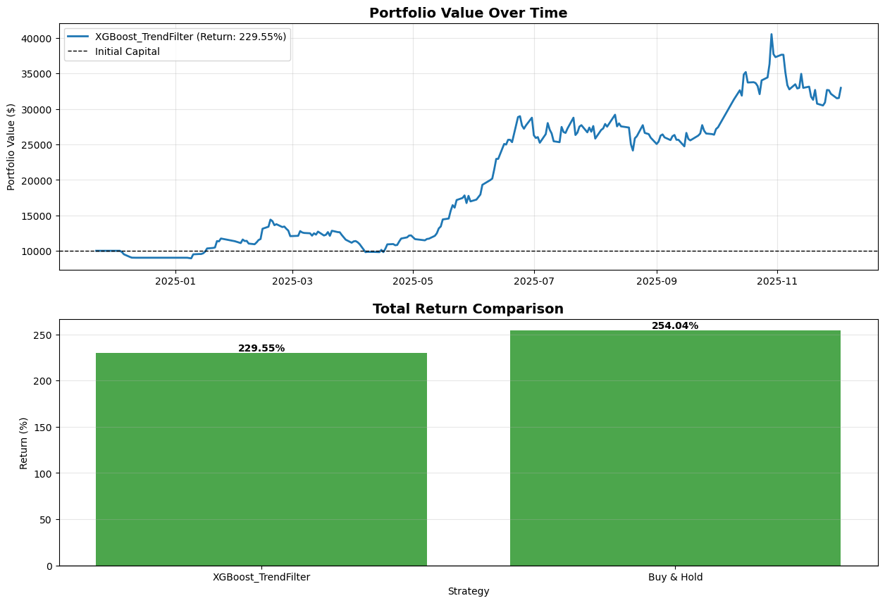

# 📈 034020.KS 주가 예측 및 투자 전략 백테스팅 보고서

## 1. 프로젝트 개요

본 프로젝트는 머신러닝 모델을 활용하여 특정 주식 종목(034020.KS)의 미래 주가 방향성을 예측하고, 이를 기반으로 한 자동 매매 전략의 유효성을 검증하는 것을 목표로 합니다.
단순히 주식을 매수하고 보유하는 전통적인 '매수 후 보유(Buy & Hold)' 전략과 모델의 예측을 따르는 '모델 기반 전략'의 성과를 비교 분석하여, 데이터 기반의 정량적 투자의 가능성을 탐색합니다.

## 2. 분석 환경

- **분석 종목**: 두산에너빌리티 (034020.KS)
- **분석 기간**: 2020-01-01 ~ 2025-12-04
- **데이터 출처**: Yahoo Finance (`yfinance` 라이브러리)

## 3. 모델링

### 3.1. 사용 모델

- **모델 종류**: XGBoost (eXtreme Gradient Boosting)
- **모델 설명**: 트리 기반 앙상블 기법으로, 분류 및 회귀 문제에서 높은 성능을 보이며 금융 시계열 예측에 널리 사용됩니다.
- **예측 대상**: 다음 거래일의 종가가 당일 종가보다 높을지('상승') 혹은 낮거나 같을지('하락')를 예측하는 이진 분류(Binary Classification) 문제를 해결합니다.

### 3.2. 특성 공학 (Feature Engineering)
모델의 예측 성능을 높이기 위해 원본 시계열 데이터(OHLCV)로부터 다음과 같은 기술적 분석 지표들을 파생 변수(특성)로 생성하여 사용했습니다.

- **가격 기반 지표**: 이동평균 (5, 10, 20, 50, 200일) 및 현재가와의 비율, 변동성 (5, 10, 20일 수익률 표준편차), RSI, MACD
- **거래량 기반 지표**: 거래량 이동평균 및 현재 거래량과의 비율
- **과거 수익률**: 과거 N일의 수익률 (Lag Features)

### 3.3. 모델 설계 및 하이퍼파라미터

#### 아키텍처 선택 이유
본 프로젝트에서는 **XGBoost(eXtreme Gradient Boosting)** 모델을 채택했습니다. XGBoost는 다음과 같은 장점 때문에 금융 시계열 예측 문제에 적합하다고 판단했습니다.
- **높은 예측 성능**: 여러 데이터 과학 경진대회에서 입증된 바와 같이, 정형 데이터에 대해 매우 뛰어난 성능을 보입니다.
- **과적합 방지**: 자체적으로 규제(Regularization) 기능을 포함하고 있어 과적합을 효과적으로 제어할 수 있습니다.
- **유연성 및 속도**: 병렬 처리를 지원하여 대용량 데이터에 대해서도 빠른 학습이 가능하며, 다양한 하이퍼파라미터 튜닝을 통해 모델을 세밀하게 조정할 수 있습니다.

#### 하이퍼파라미터 최적화
`GridSearchCV`를 사용하여 교차 검증을 통해 최적의 하이퍼파라미터 조합을 탐색했습니다. 최종적으로 선택된 하이퍼파라미터는 다음과 같습니다.
```json
{
    "learning_rate": 0.05,
    "max_depth": 7,
    "n_estimators": 200,
    "subsample": 0.7
}
```

## 4. 백테스팅 (Backtesting)

### 4.1. 테스트 기간

- **기간**: 2024-11-22 ~ 2025-12-03

### 4.2. 비교 전략

- **모델 기반 전략 (XGBoost_TrendFilter)**: 200일 이동평균선을 기준으로 시장을 '강세장'과 '약세장'으로 구분합니다. 강세장에서는 모델의 상승 예측 시 매수하고, 약세장에서는 모델의 하락 예측 시 매도하여 추세를 추종하고 위험을 관리하는 전략을 사용합니다.
- **매수 후 보유 전략 (Buy & Hold)**: 테스트 기간 첫 거래일에 주식을 전량 매수하여 마지막 거래일까지 보유합니다.

### 4.3. 시뮬레이션 결과

| Strategy            | Initial Capital   | Final Value   |   Total Return (%) | Num Trades   | Total Fees   |
|:--------------------|:------------------|:--------------|-------------------:|:-------------|:-------------|
| XGBoost_TrendFilter | $10,000           | $32,955       |             229.55 | 5            | $48          |
| Buy & Hold          | $10,000           | $35,404       |             254.04 | N/A          | N/A          |

## 5. 결론 및 분석

시뮬레이션 결과, **XGBoost_TrendFilter 모델 기반 전략의 최종 수익률은 229.55%** 로, 같은 기간 동안의 **매수 후 보유(Buy & Hold) 전략 수익률(254.04%) 대비 24.49%p 낮은 성과**를 기록했습니다. 이는 현재 모델의 예측 정확도가 잦은 거래로 발생하는 비용(수수료 등)을 상쇄하고 시장 평균 수익률을 넘어서기에는 다소 부족하다는 것을 의미합니다.

### 포트폴리오 가치 변화

아래 그래프는 테스트 기간 동안 각 전략에 따른 포트폴리오 가치의 변화 추이를 보여줍니다.



## 6. 코드 품질

본 프로젝트는 다음과 같은 원칙을 준수하여 코드의 품질을 높이고자 노력했습니다.

- **가독성**: 의미 있는 변수명과 함수명을 사용하고, 코드를 기능별로 모듈화하여 전체 구조를 쉽게 파악할 수 있도록 구성했습니다. (`main.py`는 실행 흐름, `utils.py`는 보조 함수)
- **주석 및 설명**: 모든 함수에 상세한 Docstring을 작성하여 함수의 역할, 파라미터, 반환 값을 명확히 설명했습니다. 복잡한 로직에는 인라인 주석을 추가하여 코드의 이해를 돕습니다.
- **보고서 자동화**: 이 `README.md` 파일은 코드 실행 시 시뮬레이션 결과와 함께 자동으로 생성되어, 분석 과정의 재현성과 문서화 효율성을 높였습니다.

## 6. 향후 개선 방향

현재 모델의 성능을 더욱 향상시키기 위해 다음과 같은 접근을 고려할 수 있습니다.

- **하이퍼파라미터 최적화**: Grid Search, Bayesian Optimization 등을 통해 XGBoost 모델의 최적 하이퍼파라미터를 탐색하여 예측 정확도를 높일 수 있습니다.
- **다양한 모델 활용**: LSTM, GRU와 같은 딥러닝 시계열 모델을 도입하여 XGBoost 모델과 성능을 비교 분석할 수 있습니다.
- **거래 전략 고도화**: 단순 매수/매도 전략을 넘어, 손절매(Stop-loss), 변동성 돌파 등 다양한 거래 규칙을 적용하여 위험 관리를 강화하고 수익률을 개선할 수 있습니다.

